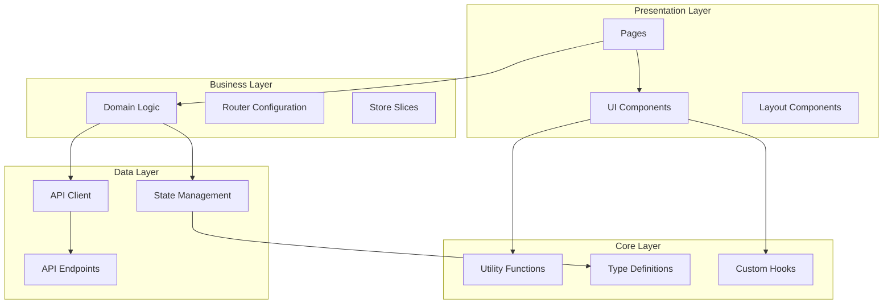
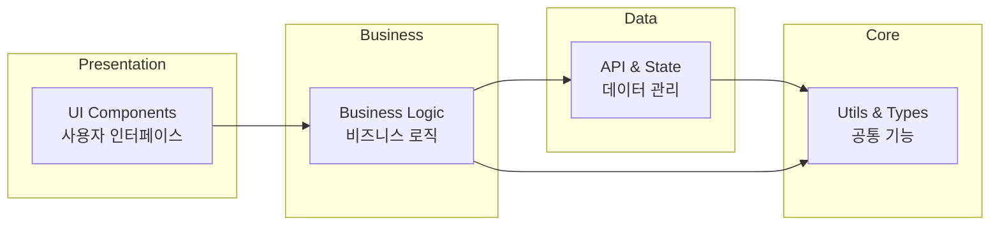
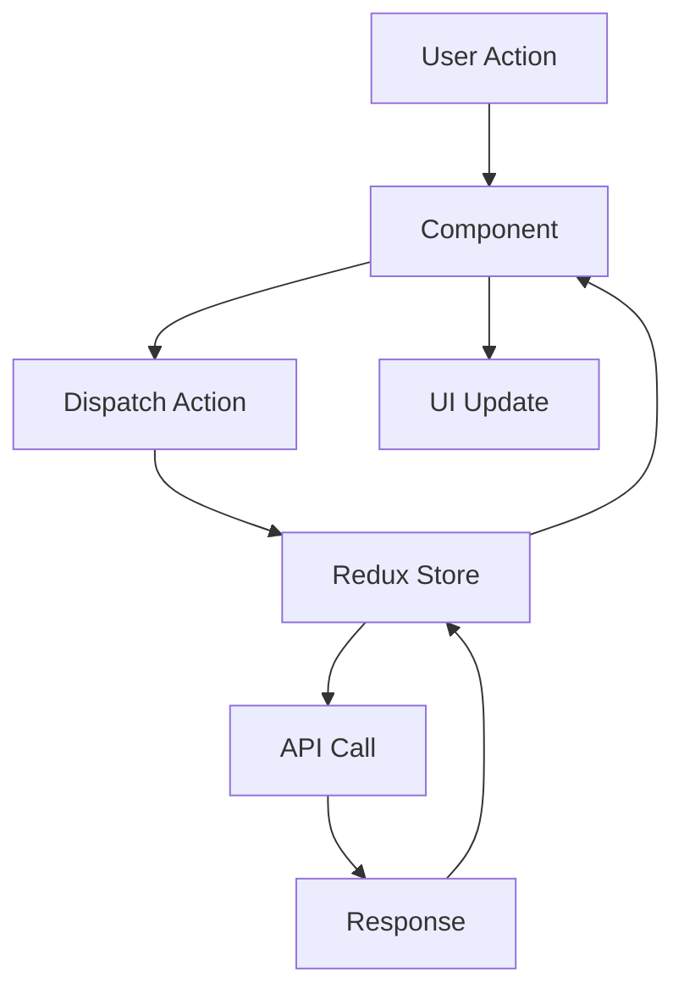
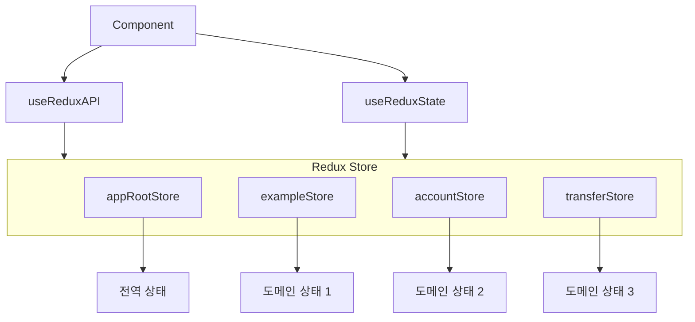
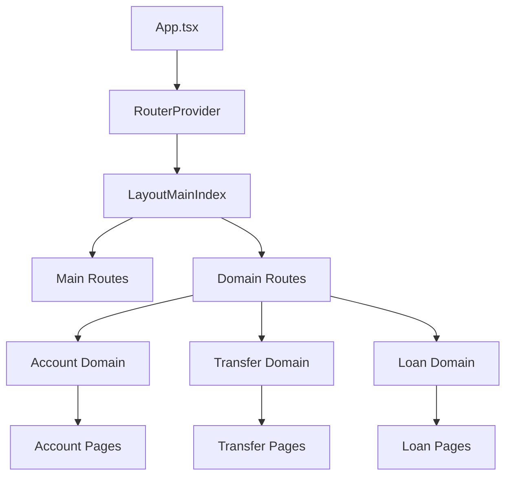
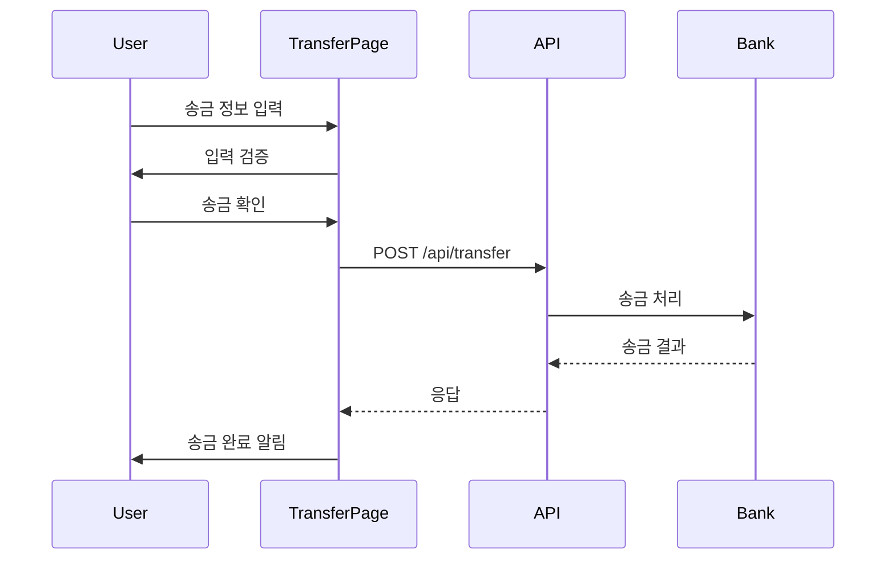

# 금융권 기업뱅킹 프론트엔드 플랫폼 구성 가이드

> **ENTEC React Assets** 기반 엔터프라이즈 금융 플랫폼 개발 가이드

[](https://react.dev/)
[](https://www.typescriptlang.org/)
[](https://vitejs.dev/)

---

## 📋 목차

1. [프로젝트 개요](#-프로젝트-개요)
2. [기술 스택 및 핵심 라이브러리](#-기술-스택-및-핵심-라이브러리)
3. [프로젝트 아키텍처](#-프로젝트-아키텍처)
4. [공통 플랫폼 영역 정의](#-공통-플랫폼-영역-정의)
5. [개발 가이드](#-개발-가이드)
6. [개발 프로세스](#-개발-프로세스)
7. [기업뱅킹 도메인 예시](#-기업뱅킹-도메인-예시)
8. [참고 자료](#-참고-자료)

---

## 🎯 프로젝트 개요

### 목적 및 비전

본 가이드는 **금융권 기업뱅킹 프로젝트**를 위한 프론트엔드 공통 플랫폼 구축 및 운영 가이드입니다. 
ENTEC React Assets를 기반으로 일관성 있고 확장 가능한 프론트엔드 생태계를 구성하는 것을 목표로 합니다.

#### 핵심 가치

- **일관성(Consistency)**: 모든 개발자가 동일한 구조와 패턴으로 개발
- **생산성(Productivity)**: 공통 컴포넌트 및 유틸리티로 개발 속도 향상
- **유지보수성(Maintainability)**: 명확한 구조와 문서화로 유지보수 용이
- **확장성(Scalability)**: 새로운 도메인 추가 시 일관된 프로세스
- **품질(Quality)**: 코딩 컨벤션과 베스트 프랙티스 공유

### 대상 독자

- **신규 투입 개발자**: 프로젝트 구조 이해 및 빠른 온보딩
- **기존 개발자**: 개발 가이드 참조 및 컨벤션 준수
- **아키텍트**: 아키텍처 설계 및 확장 전략 수립
- **프로젝트 관리자**: 프로젝트 구조 이해 및 일정 관리

### 문서 사용 가이드

1. **처음 시작하는 경우**: [초기 세팅](#61-초기-세팅) 참조
2. **개발 시작 전**: [개발 가이드](#-개발-가이드) 섹션 숙지
3. **신규 도메인 추가**: [신규 도메인 추가 워크플로우](#62-신규-도메인-추가-워크플로우) 참조
4. **컴포넌트 사용**: [공통 컴포넌트 시스템](#41-공통-컴포넌트-시스템) 참조

---

## 🛠 기술 스택 및 핵심 라이브러리

### Core 기술

| 분류 | 기술 | 버전 | 용도 |
|------|------|------|------|
| **프레임워크** | React | 19.1.1 | UI 라이브러리 |
| **언어** | TypeScript | 5.9.3 | 타입 안정성 |
| **빌드 도구** | Vite | 7.1.7 | 개발 서버 및 빌드 |

### UI 라이브러리

| 라이브러리 | 버전 | 용도 |
|------------|------|------|
| **Shadcn/ui** | - | 커스터마이징 가능한 컴포넌트 |
| **Radix UI** | 1.x | Headless UI 컴포넌트 |
| **Tailwind CSS** | 4.1.14 | 유틸리티 기반 스타일링 |
| **Lucide React** | 0.546.0 | 아이콘 라이브러리 |

### 상태 관리 및 라우팅

| 라이브러리 | 버전 | 용도 |
|------------|------|------|
| **Redux Toolkit** | 2.9.2 | 전역 상태 관리 |
| **React Redux** | 9.2.0 | React-Redux 바인딩 |
| **React Router** | 7.9.4 | SPA 라우팅 |

### HTTP 통신

| 라이브러리 | 버전 | 용도 |
|------------|------|------|
| **Axios** | 1.13.0 | HTTP 클라이언트 |

### 유틸리티

| 라이브러리 | 버전 | 용도 |
|------------|------|------|
| **date-fns** | 4.1.0 | 날짜 처리 |
| **dayjs** | 1.11.19 | 날짜 포맷팅 |
| **class-variance-authority** | 0.7.1 | 조건부 클래스 관리 |
| **clsx** | 2.1.1 | 클래스명 조합 |

### 개발 도구

| 도구 | 버전 | 용도 |
|------|------|------|
| **ESLint** | 9.36.0 | 코드 린팅 |
| **Prettier** | 3.6.2 | 코드 포맷팅 |
| **@loadable/component** | 5.16.7 | Code Splitting |

---

## 🏗 프로젝트 아키텍처

### 전체 구조 개요

프로젝트는 **레이어드 아키텍처(Layered Architecture)**를 기반으로 설계되었으며, 
관심사의 분리(Separation of Concerns)와 도메인 주도 설계(Domain-Driven Design) 원칙을 따릅니다.



### 폴더 구조

```
entec-react-assets/
├── src/
│   ├── app/                          # 애플리케이션 코어 (Core Layer)
│   │   ├── common/                   # 공통 기능
│   │   │   ├── api/                  # API 클라이언트
│   │   │   │   └── api-client.ts     # Axios 기반 API 클라이언트 (Singleton)
│   │   │   └── utils/                # 공통 유틸리티 함수
│   │   │       ├── app-utils.ts      # 애플리케이션 유틸리티
│   │   │       ├── date-utils.ts     # 날짜 처리 유틸리티
│   │   │       ├── format-utils.ts   # 포맷팅 유틸리티
│   │   │       └── string-utils.ts   # 문자열 처리 유틸리티
│   │   │
│   │   ├── components/               # 공통 UI 컴포넌트
│   │   │   ├── shadcn/               # Shadcn/ui 기반 컴포넌트
│   │   │   │   └── ui/               # 기본 UI 컴포넌트
│   │   │   └── ui/                   # 커스텀 UI 컴포넌트
│   │   │       ├── accordion/        # 아코디언
│   │   │       ├── alert/            # 알림
│   │   │       ├── alert-dialog/     # 알림 다이얼로그
│   │   │       ├── badge/            # 배지
│   │   │       ├── button/           # 버튼
│   │   │       ├── calendar/         # 캘린더
│   │   │       ├── checkbox/         # 체크박스
│   │   │       ├── confirm-dialog/   # 확인 다이얼로그
│   │   │       ├── dialog/           # 다이얼로그 서비스
│   │   │       ├── icon/             # 아이콘
│   │   │       ├── input/            # 입력 필드
│   │   │       ├── select/           # 선택 박스
│   │   │       ├── spinner/          # 로딩 스피너
│   │   │       ├── table/            # 테이블
│   │   │       └── index.ts          # UI 컴포넌트 export
│   │   │
│   │   ├── hooks/                    # 커스텀 훅
│   │   │   ├── components/           # 컴포넌트 관련 훅
│   │   │   │   └── use-ui.ts         # UI 서비스 훅
│   │   │   ├── layout/               # 레이아웃 관련 훅
│   │   │   ├── store/                # 상태 관리 훅
│   │   │   │   └── use-store.ts      # Redux 상태 관리 훅
│   │   │   └── index.ts
│   │   │
│   │   ├── router/                   # 라우터 설정
│   │   │   ├── app-common-router.ts  # 공통 라우터 설정
│   │   │   └── index.ts              # 라우터 인스턴스
│   │   │
│   │   ├── store/                    # 전역 상태 관리
│   │   │   ├── store-redux.ts        # Redux Store 설정
│   │   │   ├── store-redux-slice.ts  # Slice 생성 헬퍼
│   │   │   └── store-request-config.ts
│   │   │
│   │   └── types/                    # 타입 정의
│   │       ├── common/               # 공통 타입
│   │       │   ├── app-api-types.ts  # API 관련 타입
│   │       │   ├── app-common-types.ts
│   │       │   └── app-utils-types.ts
│   │       ├── components/           # 컴포넌트 타입
│   │       │   └── app-ui-types.ts
│   │       ├── router/               # 라우터 타입
│   │       │   └── app-router-types.ts
│   │       └── store/                # Store 타입
│   │           └── app-store-types.ts
│   │
│   ├── domains/                      # 도메인별 비즈니스 로직 (Business Layer)
│   │   ├── example/                  # 예제 도메인
│   │   │   ├── api/                  # 도메인별 API URL 정의
│   │   │   │   └── url.ts
│   │   │   ├── common/               # 도메인 공통 기능
│   │   │   │   └── utils/
│   │   │   ├── pages/                # 도메인별 페이지 컴포넌트
│   │   │   │   ├── component-list/   # UI 컴포넌트 예제
│   │   │   │   ├── api-list/         # API 사용 예제
│   │   │   │   └── specific-list/    # 특정 업무 예제
│   │   │   ├── router/               # 도메인별 라우터
│   │   │   │   └── index.tsx
│   │   │   └── store/                # 도메인별 상태 정의
│   │   │       └── index.ts
│   │   │
│   │   ├── main/                     # 메인 도메인
│   │   │   ├── pages/
│   │   │   │   └── MainIndex.tsx
│   │   │   └── router/
│   │   │       └── index.tsx
│   │   │
│   │   └── [domain-name]/            # 신규 도메인 (확장 가능)
│   │       ├── api/                  # 도메인 API
│   │       ├── pages/                # 도메인 페이지
│   │       ├── store/                # 도메인 상태
│   │       └── router/               # 도메인 라우터
│   │
│   ├── shared/                       # 프로젝트 전역 공유 (Shared Layer)
│   │   ├── components/               # 전역 공유 컴포넌트
│   │   │   ├── common/
│   │   │   │   ├── context/          # Context Provider
│   │   │   │   └── ui/               # 공통 UI
│   │   │   └── layout/               # 레이아웃 컴포넌트
│   │   │       ├── LayoutASide.tsx   # 사이드바 레이아웃
│   │   │       ├── LayoutError.tsx   # 에러 레이아웃
│   │   │       ├── LayoutFooter.tsx  # 푸터
│   │   │       ├── LayoutHeader.tsx  # 헤더
│   │   │       ├── LayoutLnb.tsx     # LNB (Left Navigation Bar)
│   │   │       └── LayoutMainIndex.tsx # 메인 레이아웃
│   │   │
│   │   ├── constants/                # 전역 상수
│   │   │   └── nav-data.ts           # 네비게이션 데이터
│   │   │
│   │   ├── router/                   # 전역 라우터 통합
│   │   │   └── index.tsx
│   │   │
│   │   └── store/                    # 전역 스토어 통합
│   │       └── app-store-redux.ts
│   │
│   ├── assets/                       # 정적 자원
│   │   ├── styles/                   # 스타일 파일
│   │   │   └── app.css
│   │   └── react.svg
│   │
│   ├── App.tsx                       # App 컴포넌트
│   ├── AppProvider.tsx               # 전역 Provider
│   ├── main.tsx                      # 진입점
│   └── vite-env.d.ts                 # Vite 환경 타입
│
├── public/                           # 공개 정적 파일
│   ├── entec_logo.ico
│   └── era.svg
│
├── @types/                           # 전역 타입 선언
│   └── index.d.ts
│
├── package.json                      # 프로젝트 설정
├── vite.config.ts                    # Vite 설정
├── tsconfig.json                     # TypeScript 설정
├── eslint.config.js                  # ESLint 설정
├── prettier.config.js                # Prettier 설정
└── components.json                   # Shadcn/ui 설정
```

### 아키텍처 원칙

#### 1. 레이어별 책임 분리



- **Presentation Layer**: 사용자 인터페이스 렌더링
- **Business Layer**: 비즈니스 로직 처리
- **Data Layer**: API 통신 및 상태 관리
- **Core Layer**: 공통 유틸리티 및 타입

#### 2. 도메인 주도 설계 (DDD)

각 비즈니스 도메인(계좌, 송금, 대출 등)을 독립적인 모듈로 구성:

```
domains/
├── account/        # 계좌관리 도메인
├── transfer/       # 송금 도메인
├── loan/           # 대출 도메인
└── fx/             # 외환 도메인
```

#### 3. 단방향 데이터 플로우



---

## 🔧 공통 플랫폼 영역 정의

### 4.1 공통 컴포넌트 시스템

#### 컴포넌트 분류

공통 컴포넌트는 크게 4가지 카테고리로 분류됩니다:

##### 1) 기본 컴포넌트 (Form Controls)

사용자 입력을 받는 기본 폼 컴포넌트

| 컴포넌트 | 경로 | 용도 |
|---------|------|------|
| `Button` | `@/app/components/ui/button` | 버튼 |
| `Input` | `@/app/components/ui/input` | 입력 필드 |
| `Select` | `@/app/components/ui/select` | 선택 박스 |
| `Checkbox` | `@/app/components/ui/checkbox` | 체크박스 |
| `Calendar` | `@/app/components/ui/calendar` | 날짜 선택 |

**사용 예시**:

```tsx
import { Button, Input, Select } from '@/app/components/ui';

function TransferForm() {
  return (
    <form>
      <Input placeholder="계좌번호" />
      <Input placeholder="송금액" type="number" />
      <Select>
        <option>즉시이체</option>
        <option>예약이체</option>
      </Select>
      <Button>송금하기</Button>
    </form>
  );
}
```

##### 2) 레이아웃 컴포넌트 (Data Display)

데이터를 표시하는 레이아웃 컴포넌트

| 컴포넌트 | 경로 | 용도 |
|---------|------|------|
| `Table` | `@/app/components/ui/table` | 데이터 테이블 |
| `Accordion` | `@/app/components/ui/accordion` | 아코디언 |
| `Badge` | `@/app/components/ui/badge` | 배지 (상태 표시) |

**Table 컴포넌트 사용 예시**:

```tsx
import { Table, TableHeader, TableBody, TableRow, TableHead, TableCell } from '@/app/components/ui';

function TransactionHistory() {
  return (
    <Table>
      <TableHeader>
        <TableRow>
          <TableHead>날짜</TableHead>
          <TableHead>거래내용</TableHead>
          <TableHead>금액</TableHead>
        </TableRow>
      </TableHeader>
      <TableBody>
        <TableRow>
          <TableCell>2026.01.20</TableCell>
          <TableCell>급여 입금</TableCell>
          <TableCell>3,000,000원</TableCell>
        </TableRow>
      </TableBody>
    </Table>
  );
}
```

##### 3) 피드백 컴포넌트 (Feedback)

사용자에게 피드백을 제공하는 컴포넌트

| 컴포넌트 | 경로 | 용도 |
|---------|------|------|
| `Alert` | `@/app/components/ui/alert` | 정보 알림 |
| `Spinner` | `@/app/components/ui/spinner` | 로딩 상태 |

##### 4) 서비스 컴포넌트 (Services)

전역에서 호출 가능한 서비스 형태의 컴포넌트

| 서비스 | 사용법 | 용도 |
|--------|--------|------|
| `$ui.alert` | `window.$ui.alert(...)` | 알림 다이얼로그 |
| `$ui.confirm` | `window.$ui.confirm(...)` | 확인 다이얼로그 |
| `$ui.dialog` | `window.$ui.dialog(...)` | 커스텀 다이얼로그 |

**서비스 컴포넌트 사용 예시**:

```tsx
// Alert 다이얼로그
await window.$ui.alert({
  title: '송금 완료',
  description: '송금이 정상적으로 처리되었습니다.',
});

// Confirm 다이얼로그
const confirmed = await window.$ui.confirm({
  title: '송금 확인',
  description: '1,000,000원을 송금하시겠습니까?',
  confirmText: '송금',
  cancelText: '취소',
});

if (confirmed) {
  // 송금 처리
}

// Custom Dialog
window.$ui.dialog.open({
  component: <CustomTransferDialog />,
  props: { accountId: '123' },
});
```

#### 컴포넌트 Export 구조

모든 UI 컴포넌트는 `@/app/components/ui/index.ts`를 통해 중앙 집중식으로 export됩니다:

```typescript
// src/app/components/ui/index.ts
export { default as Button } from './button/ButtonDefault.tsx';
export { default as Input } from './input/InputDefault.tsx';
export { default as Select } from './select/SelectDefault.tsx';
export { default as Table } from './table/TableDefault.tsx';
// ... 기타 컴포넌트

// UI 서비스 함수
export function setUIService() {
  return {
    alert: alert,
    confirm: confirm,
    dialog: dialog,
  };
}
```

### 4.2 공통 API 클라이언트

#### API Client 아키텍처

API Client는 **Singleton 패턴**으로 구현되어 있으며, Axios 기반으로 HTTP 통신을 담당합니다.

**위치**: `src/app/common/api/api-client.ts`

#### 주요 기능

##### 1) Singleton 인스턴스

```typescript
class ApiClient {
  private static instance: ApiClient;
  
  public static getInstance() {
    if (!this.instance) {
      this.instance = new ApiClient();
    }
    return this.instance;
  }
}

export default ApiClient.getInstance();
```

##### 2) Request Interceptor

API 호출 전에 실행되는 인터셉터:

- **JWT 토큰 설정**: Authorization 헤더에 토큰 추가
- **중복 호출 방지**: 동일한 요청이 중복으로 발생하지 않도록 제어
- **Base URL 설정**: 환경별 API URL 자동 설정

```typescript
this.axiosInstance.interceptors.request.use(
  (requestConfig: CommonRequestInterceptorsConfig) => {
    // JWT 토큰 설정
    // requestConfig.headers['Authorization'] = `Bearer ${token}`;
    
    // 중복 호출 방지
    const { url, data, allowDuplicate } = requestConfig;
    if (url && !allowDuplicate) {
      const hashInt = $util.hashStringTo32BitInteger(url.concat(JSON.stringify(data)));
      // 중복 체크 로직...
    }
    
    // Base URL 설정
    requestConfig.baseURL = import.meta.env.VITE_APP_API_BASE_URL;
    
    return requestConfig;
  }
);
```

##### 3) Response Interceptor

API 응답 후 실행되는 인터셉터:

- **중복 호출 목록 정리**: 완료된 요청을 목록에서 제거
- **에러 핸들링**: 공통 에러 처리
- **JWT 인증 체크**: 토큰 만료 시 재발급 또는 로그인 페이지 이동

```typescript
this.axiosInstance.interceptors.response.use(
  (response: AxiosResponse) => {
    // 중복 호출 목록에서 제거
    // 성공 응답 처리
    return Promise.resolve(response);
  },
  (error: any) => {
    // 에러 처리
    // JWT 인증 에러 처리
    throw error;
  }
);
```

#### API Client 사용법

##### 기본 사용

```typescript
import apiClient from '@/app/common/api/api-client';

// GET 요청
const response = await apiClient.request({
  method: 'GET',
  url: '/api/accounts/123',
});

// POST 요청
const response = await apiClient.request({
  method: 'POST',
  url: '/api/transfer',
  data: {
    fromAccount: '123-456-789',
    toAccount: '987-654-321',
    amount: 100000,
  },
});
```

##### 외부 API 호출

공통 Response 타입이 없는 외부 API 호출 시:

```typescript
const response = await apiClient.outerRequest({
  method: 'GET',
  url: 'https://api.external.com/data',
});
```

#### API Response 표준 형식

```typescript
// 표준 Response 구조
export interface IResponse<DataType> {
  hdr: IResponseHeader;  // 헤더
  bdy: DataType;         // 바디 (실제 데이터)
}

export interface IResponseHeader {
  rsCd: string;   // 응답 코드
  rsMsg: string;  // 응답 메시지
  svrDt: string;  // 서버 날짜
}
```

**사용 예시**:

```typescript
// 계좌 정보 조회 API
interface AccountInfo {
  accountNumber: string;
  balance: number;
  accountName: string;
}

const response = await apiClient.request<AccountInfo>({
  method: 'GET',
  url: '/api/accounts/info',
});

// response.data.hdr.rsCd === '0000' (성공)
// response.data.bdy.balance (잔액)
```

### 4.3 공통 유틸리티 함수

공통 유틸리티는 금융권 업무에서 자주 사용되는 기능들을 제공합니다.

**위치**: `src/app/common/utils/`

#### 날짜 유틸리티 (date-utils.ts)

날짜 처리 관련 유틸리티 함수

```typescript
import $util from '@/app/common/utils/app-utils';

// 날짜 포맷팅
$util.date.format(new Date(), 'YYYY-MM-DD'); // "2026-01-20"

// 날짜 계산
$util.date.addDays(new Date(), 7); // 7일 후
$util.date.addMonths(new Date(), 3); // 3개월 후

// 날짜 비교
$util.date.isBefore(date1, date2);
$util.date.isAfter(date1, date2);
```

#### 포맷 유틸리티 (format-utils.ts)

금융 데이터 포맷팅 유틸리티

```typescript
import $util from '@/app/common/utils/app-utils';

// 숫자 포맷 (천 단위 콤마)
$util.format.number(1234567); // "1,234,567"

// 통화 포맷
$util.format.currency(1234567); // "₩1,234,567"
$util.format.currency(1234.56, 'USD'); // "$1,234.56"

// 계좌번호 포맷
$util.format.account("110123456789"); // "110-1234-56789"

// 카드번호 포맷
$util.format.card("1234567890123456"); // "1234-5678-9012-3456"

// 전화번호 포맷
$util.format.phone("01012345678"); // "010-1234-5678"

// 이름 마스킹
$util.format.name("홍길동"); // "홍*동"

// 주민등록번호 포맷 (마스킹)
$util.format.residentNumber("9901011234567", true); // "990101-1******"

// 사업자등록번호 포맷
$util.format.businessNumber("1234567890"); // "123-45-67890"

// 법인등록번호 포맷
$util.format.corporationNumber("1234567890123"); // "123456-7890123"

// 퍼센트 포맷
$util.format.percent(0.1234); // "12.34%"

// 금액 포맷
$util.format.amount(1234567); // "1,234,567원"

// 파일 크기 포맷
$util.format.fileSize(1234567); // "1.18 MB"

// 텍스트 말줄임
$util.format.ellipsis("긴 텍스트입니다", 5); // "긴 텍스..."
```

#### 문자열 유틸리티 (string-utils.ts)

문자열 처리 관련 유틸리티

```typescript
import $util from '@/app/common/utils/app-utils';

// 문자열 마스킹
$util.string.mask("1234567890", 4, 8); // "1234****90"

// 빈 문자열 체크
$util.string.isEmpty(str);

// 특수문자 제거
$util.string.removeSpecialChars("abc!@#123"); // "abc123"
```

#### 애플리케이션 유틸리티 (app-utils.ts)

기타 유틸리티 함수

```typescript
import $util from '@/app/common/utils/app-utils';

// 로컬 스토리지
$util.setLocalStorage('key', value);
$util.getLocalStorage('key');
$util.removeLocalStorage('key');

// 세션 스토리지
$util.setSessionStorage('key', value);
$util.getSessionStorage('key');

// 해싱 (중복 호출 방지용)
$util.hashStringTo32BitInteger(str);
```

### 4.4 상태 관리 시스템

#### Redux Store 구조

프로젝트는 **Redux Toolkit**을 사용하여 전역 상태를 관리합니다.



#### Store 정의

각 도메인의 Store는 다음과 같이 정의합니다:

```typescript
// src/domains/example/store/index.ts
import type { IActionObject, IRootState } from '@/app/types/store';
import url from '@/domains/example/api/url';

export interface IExampleStore<T = IRootState> {
  posts: T;
  search: T;
}

const exampleAction: IExampleStore<IActionObject> = {
  // API 호출이 있는 상태
  posts: { 
    actionType: 'exampleStore/posts', 
    url: url.POSTS 
  },
  
  // API 호출이 없는 일반 상태
  search: { 
    actionType: 'exampleStore/search', 
    url: url.SEARCH 
  },
};

export default exampleAction;
```

#### 상태 사용 (useReduxAPI)

API 호출과 함께 상태를 관리하는 Hook:

```typescript
import { useReduxAPI } from '@/app/hooks';

function PostList() {
  const { data, fetch, setData } = useReduxAPI<PostType[]>('exampleStore/posts');
  
  useEffect(() => {
    // API 호출
    fetch({});
  }, []);
  
  if (data.loading) return <Spinner />;
  if (data.error) return <div>에러 발생</div>;
  
  return (
    <div>
      {data.result?.map(post => (
        <div key={post.id}>{post.title}</div>
      ))}
    </div>
  );
}
```

#### 상태 사용 (useReduxState)

API 호출 없이 단순 상태만 관리하는 Hook:

```typescript
import { useReduxState } from '@/app/hooks';

function Menu() {
  const { data, setData } = useReduxState<string>('appRootStore/appActiveMenuState');
  
  const handleMenuClick = (menuId: string) => {
    setData(menuId);
  };
  
  return (
    <nav>
      <button onClick={() => handleMenuClick('menu1')}>메뉴 1</button>
      <button onClick={() => handleMenuClick('menu2')}>메뉴 2</button>
    </nav>
  );
}
```

### 4.5 라우팅 시스템

#### 라우터 구조



#### 라우터 정의

**전역 라우터** (`src/shared/router/index.tsx`):

```typescript
import type { TAppRoute } from '@/app/types/router';
import LayoutMainIndex from '@/shared/components/layout/LayoutMainIndex';
import MainRouter from '@/domains/main/router';
import AccountRouter from '@/domains/account/router';
import TransferRouter from '@/domains/transfer/router';

const routes: TAppRoute[] = [
  {
    path: '/',
    element: <LayoutMainIndex />,
    children: MainRouter,
  },
  {
    path: '/account',
    element: <LayoutMainIndex />,
    children: AccountRouter,
  },
  {
    path: '/transfer',
    element: <LayoutMainIndex />,
    children: TransferRouter,
  },
];

export default routes;
```

**도메인 라우터** (`src/domains/account/router/index.tsx`):

```typescript
import type { TAppRoute } from '@/app/types/router';
import loadable from '@loadable/component';

// Lazy Loading
const AccountList = loadable(() => import('@/domains/account/pages/AccountList'));
const AccountDetail = loadable(() => import('@/domains/account/pages/AccountDetail'));
const TransactionHistory = loadable(() => import('@/domains/account/pages/TransactionHistory'));

const routes: TAppRoute[] = [
  {
    path: 'list',
    element: <AccountList />,
    name: 'AccountList',
  },
  {
    path: 'detail/:accountId',
    element: <AccountDetail />,
    name: 'AccountDetail',
  },
  {
    path: 'history/:accountId',
    element: <TransactionHistory />,
    name: 'TransactionHistory',
  },
];

export default routes;
```

#### 라우터 네비게이션

**페이지 이동**:

```typescript
// Router 서비스 사용
window.$router.push('/account/list');
window.$router.push('/account/detail/123');

// 뒤로 가기
window.$router.goBack();

// 파라미터와 함께 이동
window.$router.push('/transfer/create', { 
  state: { fromAccount: '123-456-789' } 
});
```

### 4.6 레이아웃 시스템

#### 레이아웃 구조

```
┌─────────────────────────────────────────┐
│           LayoutHeader (헤더)            │
├──────┬──────────────────────────────────┤
│      │                                   │
│ LNB  │        Page Content              │
│ (좌측 │        (페이지 내용)               │
│ 메뉴) │                                   │
│      │                                   │
├──────┴──────────────────────────────────┤
│           LayoutFooter (푸터)            │
└─────────────────────────────────────────┘
```

#### 레이아웃 컴포넌트

**메인 레이아웃** (`src/shared/components/layout/LayoutMainIndex.tsx`):

```typescript
import LayoutHeader from './LayoutHeader';
import LayoutLnb from './LayoutLnb';
import LayoutFooter from './LayoutFooter';
import { Outlet } from 'react-router';

function LayoutMainIndex() {
  return (
    <div className="layout-wrapper">
      <LayoutHeader />
      <div className="layout-body">
        <LayoutLnb />
        <main className="layout-content">
          <Outlet /> {/* 자식 라우트 렌더링 */}
        </main>
      </div>
      <LayoutFooter />
    </div>
  );
}
```

---

## 📚 개발 가이드

### 5.1 코딩 컨벤션

#### TypeScript 설정

프로젝트는 TypeScript **strict 모드**를 사용합니다.

```json
// tsconfig.json
{
  "compilerOptions": {
    "strict": true,
    "noImplicitAny": true,
    "strictNullChecks": true,
    "strictFunctionTypes": true
  }
}
```

#### 명명 규칙

| 대상 | 규칙 | 예시 |
|------|------|------|
| **컴포넌트** | PascalCase | `AccountList`, `TransferForm` |
| **함수/변수** | camelCase | `fetchAccountData`, `isLoading` |
| **상수** | UPPER_SNAKE_CASE | `API_BASE_URL`, `MAX_RETRY` |
| **타입/인터페이스** | PascalCase (I 접두사) | `IAccount`, `ITransferRequest` |
| **파일명 (컴포넌트)** | PascalCase | `AccountList.tsx` |
| **파일명 (유틸)** | kebab-case | `date-utils.ts`, `format-utils.ts` |
| **폴더명** | kebab-case | `account-management`, `api-client` |

#### Import 순서

```typescript
// 1. External libraries
import React, { useState, useEffect } from 'react';
import { useNavigate } from 'react-router';

// 2. Internal - App level
import { Button, Input, Table } from '@/app/components/ui';
import { useReduxAPI } from '@/app/hooks';
import apiClient from '@/app/common/api/api-client';

// 3. Internal - Domain level
import { AccountType } from '@/domains/account/types';
import accountUrl from '@/domains/account/api/url';

// 4. Styles
import './AccountList.css';
```

#### 컴포넌트 구조

```typescript
import type { IComponent } from '@/app/types/common';
import { useState, useEffect } from 'react';
import { Button, Table } from '@/app/components/ui';

// 1. 타입 정의
interface IAccountListProps {
  filter?: string;
}

interface Account {
  id: string;
  accountNumber: string;
  balance: number;
}

// 2. 컴포넌트 정의
const AccountList: IComponent<IAccountListProps> = ({ filter }) => {
  // 3. State
  const [accounts, setAccounts] = useState<Account[]>([]);
  const [loading, setLoading] = useState(false);
  
  // 4. Effects
  useEffect(() => {
    fetchAccounts();
  }, [filter]);
  
  // 5. Handlers
  const fetchAccounts = async () => {
    setLoading(true);
    // API 호출...
    setLoading(false);
  };
  
  const handleAccountClick = (accountId: string) => {
    window.$router.push(`/account/detail/${accountId}`);
  };
  
  // 6. Render
  return (
    <div className="account-list">
      <h1>계좌 목록</h1>
      {loading ? (
        <Spinner />
      ) : (
        <Table>
          {/* 테이블 내용 */}
        </Table>
      )}
    </div>
  );
};

export default AccountList;
```

### 5.2 컴포넌트 작성 가이드

#### 함수형 컴포넌트 사용

모든 컴포넌트는 **함수형 컴포넌트**로 작성합니다.

```typescript
// ✅ Good
const MyComponent: IComponent = () => {
  return <div>Hello</div>;
};

// ❌ Bad (클래스 컴포넌트)
class MyComponent extends React.Component {
  render() {
    return <div>Hello</div>;
  }
}
```

#### Props 타입 정의

Props는 반드시 TypeScript 인터페이스로 정의합니다.

```typescript
interface ITransferFormProps {
  fromAccount: string;
  onSubmit: (data: TransferData) => void;
  maxAmount?: number; // Optional prop
}

const TransferForm: IComponent<ITransferFormProps> = ({ 
  fromAccount, 
  onSubmit, 
  maxAmount = 10000000 
}) => {
  // ...
};
```

#### 컴포넌트 분리 원칙

**단일 책임 원칙(Single Responsibility Principle)**을 따릅니다:

```typescript
// ❌ Bad - 하나의 컴포넌트에 너무 많은 책임
function AccountPage() {
  return (
    <div>
      {/* 계좌 목록 */}
      <div>{/* ... 100줄 */}</div>
      {/* 거래 내역 */}
      <div>{/* ... 100줄 */}</div>
      {/* 통계 */}
      <div>{/* ... 100줄 */}</div>
    </div>
  );
}

// ✅ Good - 책임별로 분리
function AccountPage() {
  return (
    <div>
      <AccountList />
      <TransactionHistory />
      <AccountStatistics />
    </div>
  );
}
```

#### 재사용 가능한 컴포넌트 작성

```typescript
// ✅ Good - 재사용 가능한 컴포넌트
interface IAmountDisplayProps {
  amount: number;
  currency?: string;
  showSign?: boolean;
}

const AmountDisplay: IComponent<IAmountDisplayProps> = ({ 
  amount, 
  currency = 'KRW',
  showSign = false 
}) => {
  const formatted = $util.format.currency(amount, currency);
  const sign = showSign && amount > 0 ? '+' : '';
  
  return <span className="amount">{sign}{formatted}</span>;
};

// 여러 곳에서 재사용
<AmountDisplay amount={1000000} />
<AmountDisplay amount={-50000} showSign />
<AmountDisplay amount={100.5} currency="USD" />
```

### 5.3 API 연동 가이드

#### API URL 정의

각 도메인의 API URL은 별도 파일로 관리합니다.

```typescript
// src/domains/account/api/url.ts
const accountUrl = {
  ACCOUNT_LIST: '/api/account/list',
  ACCOUNT_DETAIL: '/api/account/detail',
  ACCOUNT_BALANCE: '/api/account/balance',
  TRANSACTION_HISTORY: '/api/account/transactions',
};

export default accountUrl;
```

#### API 호출 패턴

##### 패턴 1: Redux Store와 함께 사용

```typescript
import { useReduxAPI } from '@/app/hooks';
import accountUrl from '@/domains/account/api/url';

function AccountList() {
  const { data, fetch, setData } = useReduxAPI<Account[]>('accountStore/accountList');
  
  useEffect(() => {
    // API 호출
    fetch({
      accountType: 'all',
    });
  }, []);
  
  // loading, error, result 상태 자동 관리
  if (data.loading) return <Spinner />;
  if (data.error) return <ErrorMessage error={data.error} />;
  
  return (
    <div>
      {data.result?.map(account => (
        <AccountCard key={account.id} account={account} />
      ))}
    </div>
  );
}
```

##### 패턴 2: 직접 API 호출

```typescript
import apiClient from '@/app/common/api/api-client';
import accountUrl from '@/domains/account/api/url';

async function transferMoney(transferData: TransferRequest) {
  try {
    const response = await apiClient.request<TransferResponse>({
      method: 'POST',
      url: accountUrl.TRANSFER,
      data: transferData,
    });
    
    if (response.data.hdr.rsCd === '0000') {
      // 성공
      await window.$ui.alert({
        title: '송금 완료',
        description: '송금이 성공적으로 완료되었습니다.',
      });
    } else {
      // 실패
      throw new Error(response.data.hdr.rsMsg);
    }
  } catch (error) {
    // 에러 처리
    await window.$ui.alert({
      title: '송금 실패',
      description: error.message,
    });
  }
}
```

#### Request/Response 타입 정의

```typescript
// Request 타입
export interface TransferRequest {
  fromAccount: string;
  toAccount: string;
  amount: number;
  memo?: string;
}

// Response 타입
export interface TransferResponse {
  transactionId: string;
  transferDate: string;
  status: 'completed' | 'pending' | 'failed';
}

// API 호출
const response = await apiClient.request<TransferResponse>({
  method: 'POST',
  url: '/api/transfer',
  data: {
    fromAccount: '123-456-789',
    toAccount: '987-654-321',
    amount: 100000,
  } as TransferRequest,
});
```

#### 에러 핸들링 전략

```typescript
try {
  const response = await apiClient.request<DataType>({
    method: 'GET',
    url: '/api/data',
  });
  
  // 응답 코드 체크
  if (response.data.hdr.rsCd === '0000') {
    // 성공
    return response.data.bdy;
  } else {
    // 비즈니스 로직 에러
    throw new Error(response.data.hdr.rsMsg);
  }
} catch (error) {
  if (error.response) {
    // 서버 응답 있음 (4xx, 5xx)
    console.error('Server Error:', error.response.status);
    
    if (error.response.status === 401) {
      // 인증 에러 - 로그인 페이지로 이동
      window.$router.push('/login');
    } else if (error.response.status === 500) {
      // 서버 에러
      await window.$ui.alert({
        title: '시스템 오류',
        description: '일시적인 오류가 발생했습니다. 잠시 후 다시 시도해주세요.',
      });
    }
  } else if (error.request) {
    // 요청은 보냈지만 응답 없음 (네트워크 에러)
    await window.$ui.alert({
      title: '네트워크 오류',
      description: '네트워크 연결을 확인해주세요.',
    });
  } else {
    // 기타 에러
    console.error('Error:', error.message);
  }
}
```

### 5.4 상태 관리 가이드

#### Store 생성 절차

##### 1단계: API URL 정의

```typescript
// src/domains/transfer/api/url.ts
const transferUrl = {
  TRANSFER_CREATE: '/api/transfer/create',
  TRANSFER_LIST: '/api/transfer/list',
  TRANSFER_CANCEL: '/api/transfer/cancel',
};

export default transferUrl;
```

##### 2단계: Store Action 정의

```typescript
// src/domains/transfer/store/index.ts
import type { IActionObject, IRootState } from '@/app/types/store';
import url from '@/domains/transfer/api/url';

export interface ITransferStore<T = IRootState> {
  transferList: T;
  transferCreate: T;
  selectedTransfer: T; // API 없는 일반 상태
}

const transferAction: ITransferStore<IActionObject> = {
  transferList: {
    actionType: 'transferStore/transferList',
    url: url.TRANSFER_LIST,
  },
  transferCreate: {
    actionType: 'transferStore/transferCreate',
    url: url.TRANSFER_CREATE,
  },
  selectedTransfer: {
    actionType: 'transferStore/selectedTransfer',
    // url 없음 - 일반 상태
  },
};

export default transferAction;
```

##### 3단계: Store 등록

```typescript
// src/shared/store/app-store-redux.ts
import { setReducer } from '@/app/store/store-redux';
import transferAction from '@/domains/transfer/store';

export default function generatedStore() {
  return setReducer({
    transferStore: transferAction,
    // ... 다른 도메인 store
  });
}
```

##### 4단계: 컴포넌트에서 사용

```typescript
import { useReduxAPI } from '@/app/hooks';

function TransferList() {
  const { data, fetch } = useReduxAPI<Transfer[]>('transferStore/transferList');
  
  useEffect(() => {
    fetch({ status: 'all' });
  }, []);
  
  return (
    <div>
      {data.result?.map(transfer => (
        <TransferItem key={transfer.id} data={transfer} />
      ))}
    </div>
  );
}
```

#### 비동기 액션 처리

Redux Store는 자동으로 비동기 액션을 처리하며, 다음 상태를 제공합니다:

- `loading`: 로딩 상태
- `error`: 에러 객체
- `result`: 결과 데이터

```typescript
const { data, fetch } = useReduxAPI<DataType>('storeName/actionName');

console.log(data.loading);  // boolean
console.log(data.error);    // Error | null
console.log(data.result);   // DataType | null
```

### 5.5 라우팅 가이드

#### 라우터 정의

```typescript
// src/domains/account/router/index.tsx
import type { TAppRoute } from '@/app/types/router';
import loadable from '@loadable/component';

const AccountList = loadable(() => import('../pages/AccountList'));
const AccountDetail = loadable(() => import('../pages/AccountDetail'));

const routes: TAppRoute[] = [
  {
    path: 'list',
    element: <AccountList />,
    name: 'AccountList',
  },
  {
    path: 'detail/:accountId',
    element: <AccountDetail />,
    name: 'AccountDetail',
  },
];

export default routes;
```

#### 페이지 네비게이션

```typescript
// 기본 이동
window.$router.push('/account/list');

// 파라미터와 함께 이동
window.$router.push('/account/detail/123');

// State와 함께 이동
window.$router.push('/transfer/create', {
  state: {
    fromAccount: '123-456-789',
    returnUrl: '/account/list',
  },
});

// 뒤로 가기
window.$router.goBack();

// 특정 페이지 수만큼 이동
window.$router.go(-2); // 2페이지 뒤로
```

#### Dynamic Route Parameters

```typescript
// 라우터 정의
{
  path: 'detail/:accountId',
  element: <AccountDetail />,
}

// 컴포넌트에서 파라미터 사용
import { useParams } from 'react-router';

function AccountDetail() {
  const { accountId } = useParams<{ accountId: string }>();
  
  useEffect(() => {
    fetchAccountDetail(accountId);
  }, [accountId]);
  
  return <div>Account ID: {accountId}</div>;
}
```

#### Query Parameters

```typescript
import { useSearchParams } from 'react-router';

function AccountList() {
  const [searchParams, setSearchParams] = useSearchParams();
  
  const filter = searchParams.get('filter'); // ?filter=active
  const page = searchParams.get('page'); // ?page=2
  
  // Query Parameter 변경
  const handleFilterChange = (newFilter: string) => {
    setSearchParams({ filter: newFilter, page: '1' });
  };
  
  return <div>Filter: {filter}</div>;
}
```

#### Protected Routes

인증이 필요한 페이지 보호:

```typescript
// src/shared/components/common/ProtectedRoute.tsx
import { Navigate } from 'react-router';

function ProtectedRoute({ children }: { children: React.ReactNode }) {
  const isAuthenticated = checkAuth(); // 인증 체크 로직
  
  if (!isAuthenticated) {
    return <Navigate to="/login" replace />;
  }
  
  return <>{children}</>;
}

// 라우터에 적용
{
  path: 'account',
  element: (
    <ProtectedRoute>
      <AccountLayout />
    </ProtectedRoute>
  ),
  children: accountRoutes,
}
```

---

## ⚙️ 개발 프로세스

### 6.1 초기 세팅

#### 환경 요구사항

- **Node.js**: 18.x 이상
- **npm**: 9.x 이상
- **운영체제**: Windows, macOS, Linux

#### 설치 및 실행

```bash
# 1. 저장소 클론
git clone [repository-url]
cd entec-react-assets

# 2. 의존성 설치
npm install

# 3. 환경 변수 설정
cp .env.example .env

# 4. 개발 서버 실행
npm run dev
```

#### 환경 변수 설정

`.env` 파일 생성 및 설정:

```bash
# API Base URL
VITE_APP_API_BASE_URL=https://api.example.com
VITE_APP_API2_BASE_URL=https://api2.example.com

# Router Base Name
VITE_ROUTER_BASENAME=/

# Build Base URL
VITE_BASE_URL=/
```

#### 개발 서버 접속

```
http://localhost:5173
```

### 6.2 신규 도메인 추가 워크플로우

금융권 기업뱅킹에서 새로운 비즈니스 도메인(예: 외환, 대출)을 추가하는 전체 프로세스입니다.

#### 예시: 대출(Loan) 도메인 추가

##### 1단계: 도메인 폴더 구조 생성

```bash
src/domains/loan/
├── api/
│   └── url.ts
├── pages/
│   ├── LoanList.tsx
│   ├── LoanDetail.tsx
│   └── LoanApply.tsx
├── store/
│   └── index.ts
└── router/
    └── index.tsx
```

##### 2단계: API URL 정의

```typescript
// src/domains/loan/api/url.ts
const loanUrl = {
  LOAN_LIST: '/api/loan/list',
  LOAN_DETAIL: '/api/loan/detail',
  LOAN_APPLY: '/api/loan/apply',
  LOAN_PAYMENT: '/api/loan/payment',
};

export default loanUrl;
```

##### 3단계: Store 정의

```typescript
// src/domains/loan/store/index.ts
import type { IActionObject, IRootState } from '@/app/types/store';
import url from '@/domains/loan/api/url';

export interface ILoanStore<T = IRootState> {
  loanList: T;
  loanDetail: T;
  selectedLoan: T;
}

const loanAction: ILoanStore<IActionObject> = {
  loanList: {
    actionType: 'loanStore/loanList',
    url: url.LOAN_LIST,
  },
  loanDetail: {
    actionType: 'loanStore/loanDetail',
    url: url.LOAN_DETAIL,
  },
  selectedLoan: {
    actionType: 'loanStore/selectedLoan',
  },
};

export default loanAction;
```

##### 4단계: 페이지 컴포넌트 작성

```typescript
// src/domains/loan/pages/LoanList.tsx
import type { IComponent } from '@/app/types/common';
import { useReduxAPI } from '@/app/hooks';
import { Table, Button, Spinner } from '@/app/components/ui';

interface Loan {
  loanId: string;
  loanName: string;
  amount: number;
  interestRate: number;
  status: string;
}

const LoanList: IComponent = () => {
  const { data, fetch } = useReduxAPI<Loan[]>('loanStore/loanList');
  
  useEffect(() => {
    fetch({});
  }, []);
  
  if (data.loading) return <Spinner />;
  
  return (
    <div className="loan-list">
      <h1>대출 목록</h1>
      <Table>
        <TableHeader>
          <TableRow>
            <TableHead>대출명</TableHead>
            <TableHead>대출금액</TableHead>
            <TableHead>금리</TableHead>
            <TableHead>상태</TableHead>
          </TableRow>
        </TableHeader>
        <TableBody>
          {data.result?.map(loan => (
            <TableRow key={loan.loanId}>
              <TableCell>{loan.loanName}</TableCell>
              <TableCell>{$util.format.currency(loan.amount)}</TableCell>
              <TableCell>{$util.format.percent(loan.interestRate)}</TableCell>
              <TableCell>{loan.status}</TableCell>
            </TableRow>
          ))}
        </TableBody>
      </Table>
    </div>
  );
};

export default LoanList;
```

##### 5단계: 라우터 설정

```typescript
// src/domains/loan/router/index.tsx
import type { TAppRoute } from '@/app/types/router';
import loadable from '@loadable/component';

const LoanList = loadable(() => import('@/domains/loan/pages/LoanList'));
const LoanDetail = loadable(() => import('@/domains/loan/pages/LoanDetail'));
const LoanApply = loadable(() => import('@/domains/loan/pages/LoanApply'));

const routes: TAppRoute[] = [
  {
    path: 'list',
    element: <LoanList />,
    name: 'LoanList',
  },
  {
    path: 'detail/:loanId',
    element: <LoanDetail />,
    name: 'LoanDetail',
  },
  {
    path: 'apply',
    element: <LoanApply />,
    name: 'LoanApply',
  },
];

export default routes;
```

##### 6단계: 전역 라우터에 등록

```typescript
// src/shared/router/index.tsx
import LoanRouter from '@/domains/loan/router';

const routes: TAppRoute[] = [
  // ... 기존 라우터
  {
    path: '/loan',
    element: <LayoutMainIndex />,
    children: LoanRouter,
  },
];
```

##### 7단계: 전역 Store에 등록

```typescript
// src/shared/store/app-store-redux.ts
import loanAction from '@/domains/loan/store';

export default function generatedStore() {
  return setReducer({
    // ... 기존 스토어
    loanStore: loanAction,
  });
}
```

##### 8단계: 네비게이션 메뉴 추가

```typescript
// src/shared/constants/nav-data.ts
export const navData = [
  // ... 기존 메뉴
  {
    title: '대출',
    url: '/loan/list',
    icon: CreditCard,
    items: [
      { title: '대출 목록', url: '/loan/list' },
      { title: '대출 신청', url: '/loan/apply' },
    ],
  },
];
```

### 6.3 빌드 및 배포

#### 빌드

```bash
# 프로덕션 빌드
npm run build

# 빌드 결과 확인
# dist/ 폴더에 생성됨
```

#### 린트 검사

```bash
# 린트 검사
npm run lint

# 린트 자동 수정
npm run lint:fix
```

#### 프리뷰

```bash
# 빌드된 결과물 로컬 서버로 확인
npm run preview
```

#### 배포 체크리스트

- [ ] 모든 린트 에러 해결
- [ ] TypeScript 컴파일 에러 없음
- [ ] 환경 변수 프로덕션 설정 확인
- [ ] API Base URL 프로덕션 URL로 변경
- [ ] 빌드 성공 확인
- [ ] 프리뷰 서버에서 동작 확인
- [ ] 주요 기능 테스트 완료
- [ ] 크로스 브라우저 테스트 완료

---

## 🏦 기업뱅킹 도메인 예시

금융권 기업뱅킹에서 일반적으로 다루는 주요 도메인들의 구조와 구현 가이드입니다.

### 7.1 계좌관리 (Account Management)

#### 주요 기능

- 계좌 조회
- 잔액 확인
- 거래 내역 조회
- 계좌 개설/해지

#### 폴더 구조

```
domains/account/
├── api/
│   └── url.ts
├── pages/
│   ├── AccountList.tsx          # 계좌 목록
│   ├── AccountDetail.tsx        # 계좌 상세
│   ├── TransactionHistory.tsx   # 거래 내역
│   └── AccountCreate.tsx        # 계좌 개설
├── store/
│   └── index.ts
├── router/
│   └── index.tsx
└── types/
    └── index.ts
```

#### API 정의

```typescript
// api/url.ts
const accountUrl = {
  ACCOUNT_LIST: '/api/account/list',
  ACCOUNT_DETAIL: '/api/account/detail',
  ACCOUNT_BALANCE: '/api/account/balance',
  TRANSACTION_HISTORY: '/api/account/transactions',
  ACCOUNT_CREATE: '/api/account/create',
};
```

#### Store 정의

```typescript
// store/index.ts
const accountAction = {
  accountList: { 
    actionType: 'accountStore/accountList', 
    url: accountUrl.ACCOUNT_LIST 
  },
  accountDetail: { 
    actionType: 'accountStore/accountDetail', 
    url: accountUrl.ACCOUNT_DETAIL 
  },
  transactionHistory: { 
    actionType: 'accountStore/transactionHistory', 
    url: accountUrl.TRANSACTION_HISTORY 
  },
};
```

#### 화면 예시

```typescript
// pages/AccountList.tsx
const AccountList: IComponent = () => {
  const { data, fetch } = useReduxAPI<Account[]>('accountStore/accountList');
  
  useEffect(() => {
    fetch({ accountType: 'all' });
  }, []);
  
  return (
    <div>
      <h1>계좌 목록</h1>
      {data.result?.map(account => (
        <div key={account.accountId}>
          <p>계좌번호: {$util.format.account(account.accountNumber)}</p>
          <p>잔액: {$util.format.currency(account.balance)}</p>
        </div>
      ))}
    </div>
  );
};
```

### 7.2 송금/이체 (Transfer)

#### 주요 기능

- 국내 송금
- 타행 이체
- 예약 이체
- 이체 내역 조회

#### 폴더 구조

```
domains/transfer/
├── api/
│   └── url.ts
├── pages/
│   ├── TransferCreate.tsx       # 송금 실행
│   ├── TransferSchedule.tsx     # 예약 이체
│   ├── TransferHistory.tsx      # 이체 내역
│   └── TransferConfirm.tsx      # 이체 확인
├── components/
│   ├── TransferForm.tsx         # 송금 폼 컴포넌트
│   └── TransferReceipt.tsx      # 이체 영수증
├── store/
│   └── index.ts
└── router/
    └── index.tsx
```

#### 송금 플로우



#### 구현 예시

```typescript
// pages/TransferCreate.tsx
const TransferCreate: IComponent = () => {
  const [formData, setFormData] = useState<TransferRequest>({
    fromAccount: '',
    toAccount: '',
    amount: 0,
    memo: '',
  });
  
  const handleSubmit = async () => {
    // 1. 입력 검증
    if (!formData.fromAccount || !formData.toAccount) {
      await window.$ui.alert({
        title: '입력 오류',
        description: '계좌번호를 입력해주세요.',
      });
      return;
    }
    
    // 2. 확인 다이얼로그
    const confirmed = await window.$ui.confirm({
      title: '송금 확인',
      description: `${$util.format.currency(formData.amount)}을 송금하시겠습니까?`,
    });
    
    if (!confirmed) return;
    
    // 3. API 호출
    try {
      const response = await apiClient.request<TransferResponse>({
        method: 'POST',
        url: transferUrl.TRANSFER_CREATE,
        data: formData,
      });
      
      if (response.data.hdr.rsCd === '0000') {
        await window.$ui.alert({
          title: '송금 완료',
          description: '송금이 완료되었습니다.',
        });
        window.$router.push('/transfer/history');
      }
    } catch (error) {
      await window.$ui.alert({
        title: '송금 실패',
        description: error.message,
      });
    }
  };
  
  return (
    <div>
      <h1>송금</h1>
      <Input 
        placeholder="출금 계좌" 
        value={formData.fromAccount}
        onChange={(e) => setFormData({ ...formData, fromAccount: e.target.value })}
      />
      <Input 
        placeholder="입금 계좌" 
        value={formData.toAccount}
        onChange={(e) => setFormData({ ...formData, toAccount: e.target.value })}
      />
      <Input 
        type="number"
        placeholder="송금액" 
        value={formData.amount}
        onChange={(e) => setFormData({ ...formData, amount: Number(e.target.value) })}
      />
      <Button onClick={handleSubmit}>송금하기</Button>
    </div>
  );
};
```

### 7.3 대출 (Loan)

#### 주요 기능

- 대출 신청
- 대출 조회
- 상환 관리
- 대출 계산기

#### 폴더 구조

```
domains/loan/
├── api/
│   └── url.ts
├── pages/
│   ├── LoanList.tsx             # 대출 목록
│   ├── LoanDetail.tsx           # 대출 상세
│   ├── LoanApply.tsx            # 대출 신청
│   ├── LoanCalculator.tsx       # 대출 계산기
│   └── LoanPayment.tsx          # 상환 관리
├── components/
│   ├── LoanCard.tsx             # 대출 카드 컴포넌트
│   └── PaymentSchedule.tsx      # 상환 스케줄
├── store/
│   └── index.ts
└── router/
    └── index.tsx
```

### 7.4 외환 (Foreign Exchange)

#### 주요 기능

- 환율 조회
- 외환 송금
- 환전
- 환율 알림

#### 폴더 구조

```
domains/fx/
├── api/
│   └── url.ts
├── pages/
│   ├── ExchangeRate.tsx         # 환율 조회
│   ├── ForeignTransfer.tsx      # 외환 송금
│   ├── CurrencyExchange.tsx     # 환전
│   └── RateAlert.tsx            # 환율 알림
├── components/
│   ├── RateChart.tsx            # 환율 차트
│   └── CurrencySelector.tsx     # 통화 선택기
├── store/
│   └── index.ts
└── router/
    └── index.tsx
```

### 7.5 결제 (Payment)

#### 주요 기능

- 급여 이체
- 대량 이체
- 펌뱅킹 (Firm Banking)
- 자동이체

#### 폴더 구조

```
domains/payment/
├── api/
│   └── url.ts
├── pages/
│   ├── SalaryTransfer.tsx       # 급여 이체
│   ├── BulkTransfer.tsx         # 대량 이체
│   ├── FirmBanking.tsx          # 펌뱅킹
│   └── AutoTransfer.tsx         # 자동이체
├── components/
│   ├── BulkUpload.tsx           # 대량 업로드
│   └── TransferPreview.tsx      # 이체 미리보기
├── store/
│   └── index.ts
└── router/
    └── index.tsx
```

#### 대량 이체 구현 예시

```typescript
// pages/BulkTransfer.tsx
const BulkTransfer: IComponent = () => {
  const [file, setFile] = useState<File | null>(null);
  const [transfers, setTransfers] = useState<BulkTransferItem[]>([]);
  
  const handleFileUpload = (e: React.ChangeEvent<HTMLInputElement>) => {
    const file = e.target.files?.[0];
    if (file) {
      // Excel 파일 파싱
      parseExcelFile(file).then(data => {
        setTransfers(data);
      });
    }
  };
  
  const handleBulkTransfer = async () => {
    const confirmed = await window.$ui.confirm({
      title: '대량 이체 확인',
      description: `총 ${transfers.length}건, ${$util.format.currency(getTotalAmount())}을 이체하시겠습니까?`,
    });
    
    if (!confirmed) return;
    
    // 대량 이체 API 호출
    const response = await apiClient.request({
      method: 'POST',
      url: paymentUrl.BULK_TRANSFER,
      data: { transfers },
    });
    
    // 결과 처리
    // ...
  };
  
  return (
    <div>
      <h1>대량 이체</h1>
      <input type="file" onChange={handleFileUpload} accept=".xlsx,.xls" />
      <Table>
        {/* 이체 목록 표시 */}
      </Table>
      <Button onClick={handleBulkTransfer}>이체 실행</Button>
    </div>
  );
};
```

---

## 📖 참고 자료

### 공식 가이드 및 문서

- **ENTEC React Assets 가이드**: http://redsky0212.dothome.co.kr/entec/react_assets/guide/
- **프로젝트 README**: [README.md](./README.md)

### 기술 문서

#### React & TypeScript
- [React 공식 문서](https://react.dev/)
- [TypeScript 핸드북](https://www.typescriptlang.org/docs/)
- [React TypeScript Cheatsheet](https://react-typescript-cheatsheet.netlify.app/)

#### UI 라이브러리
- [Shadcn/ui 문서](https://ui.shadcn.com/)
- [Radix UI 문서](https://www.radix-ui.com/)
- [Tailwind CSS 문서](https://tailwindcss.com/docs)

#### 상태 관리 & 라우팅
- [Redux Toolkit 문서](https://redux-toolkit.js.org/)
- [React Router 문서](https://reactrouter.com/)

#### 빌드 & 개발 도구
- [Vite 문서](https://vitejs.dev/)
- [ESLint 문서](https://eslint.org/)
- [Prettier 문서](https://prettier.io/)

### 컴포넌트 예제

프로젝트 내 `domains/example` 폴더에서 다양한 예제를 확인할 수 있습니다:

- **UI 컴포넌트 예제**: `domains/example/pages/component-list/`
- **API 연동 예제**: `domains/example/pages/api-list/`
- **특정 업무 예제**: `domains/example/pages/specific-list/`

### API Reference

#### 전역 객체

| 객체 | 설명 | 위치 |
|------|------|------|
| `window.$router` | 라우터 서비스 | `src/app/router/` |
| `window.$util` | 유틸리티 함수 | `src/app/common/utils/` |
| `window.$ui` | UI 서비스 (alert, confirm, dialog) | `src/app/components/ui/` |

#### 커스텀 훅

| 훅 | 설명 | 위치 |
|------|------|------|
| `useReduxAPI` | API 연동 상태 관리 | `src/app/hooks/store/use-store.ts` |
| `useReduxState` | 일반 상태 관리 | `src/app/hooks/store/use-store.ts` |

### 문의 및 지원

프로젝트 관련 문의사항이나 이슈는 다음을 통해 제기해주세요:

- **GitHub Issues**: [프로젝트 저장소 Issues]
- **내부 커뮤니케이션**: Slack, Teams 등

---

## 📝 버전 히스토리

| 버전 | 날짜 | 변경 내용 |
|------|------|-----------|
| 1.0.0 | 2026-01-20 | 초기 가이드 문서 작성 |

---

## ⚖️ 라이선스

본 프로젝트는 [라이선스 유형]에 따라 배포됩니다.

---

<div align="center">
  <p><strong>ENTEC React Assets</strong></p>
  <p>금융권 기업뱅킹 프론트엔드 플랫폼</p>
  <p>© 2026 ENTEC. All rights reserved.</p>
</div>
